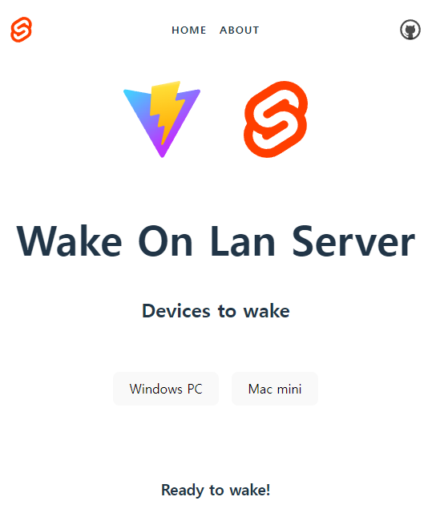

## Pi Wake on Lan


Without router that provide WOL function, 
It makes wake device everywhere and everytime.   

## Requirements

1. Always-on Linux Machine (tested on Raspberry Pi).
2. Port Forwarding. 
    To connect outside of LAN, port need to be exposed.
3. DDNS(Optional).

## Install

This app need [etherwake](https://packages.debian.org/sid/etherwake), `nodejs`.

```shell
# debian
sudo apt install etherwake -y
npm install
```
It tested on node 18 and above. 

And developed with SvelteKit and TypeScript in Vite.

## Setting
It needs JSON file that decribed devices to wake.

`wol.config.json` 
```json
{
    "device1_name":"device1_macaddr",
    "device2_name":"device2_macaddr"
}
```

## Execute
```shell
# serve
npm run dev
# build
npm run build
# preview : start with builded
npm run preview

```


## Recommended IDE Setup

[VS Code](https://code.visualstudio.com/) + [Svelte](https://marketplace.visualstudio.com/items?itemName=svelte.svelte-vscode).

